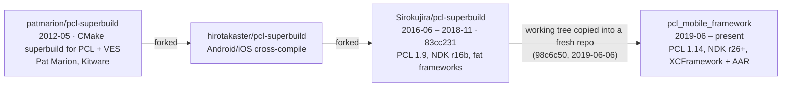

# Lineage

`pcl_mobile_framework` is the successor to
[**Sirokujira/pcl-superbuild**](https://github.com/Sirokujira/pcl-superbuild).
It is not a rewrite from scratch: the repository started life on 2019-06-06 as a
partial copy of that project's working tree, and everything since has been an
incremental modernization of the same build system and the same packaging idea.

Because the copy was made with plain `cp` rather than `git clone`, GitHub does
not show the two repositories as fork and parent. This document — plus the
history graft described in [Reconstructed git history](#reconstructed-git-history)
— is the record of that relationship.

## Timeline



| Stage | Repository | Range | Boundary commit |
|---|---|---|---|
| Origin | `patmarion/pcl-superbuild` | 2012-05-23 → | `7bbe666` — first commit, Pat Marion (Kitware) |
| Fork | `hirotakaster/pcl-superbuild` | → 2016 | GitHub fork parent of the next row |
| Predecessor | `Sirokujira/pcl-superbuild` | 2016-06-14 → 2018-11-23 | `83cc231` — last development commit |
| Current | `Sirokujira/pcl_mobile_framework` | 2019-06-06 → | `98c6c50` — initial import |

The first three rows share one continuous git history; GitHub still records
`Sirokujira/pcl-superbuild` as a fork of `hirotakaster/pcl-superbuild`. Only
the last hop lost its ancestry, and that is what the graft below restores.

`83cc231` is tagged in this repository as **`pcl-superbuild-origin`**.

## Reconstructed git history

The predecessor's commits are present in this repository as a `refs/replace`
graft that attaches `98c6c50` ("add build pcl binaries generate files", the
initial import) to `83cc231` (pcl-superbuild's last development commit; that
repository has since received only a pointer to this one). Nothing is
rewritten — every existing SHA stays valid — but `git log` walks straight
through the seam back to 2012.

```bash
git fetch origin 'refs/replace/*:refs/replace/*'
git log --oneline | tail -5   # ends at 7bbe666 (authored 2012-05-23)
```

```bash
git log --oneline pcl-superbuild-origin   # the predecessor's history alone
```

To ignore the graft for a single command, use `git --no-replace-objects log`.
GitHub's web UI and API do not apply replace refs, so the seam is only visible
in a clone that has fetched them.

Maintainers re-creating the graft from scratch:

```bash
git remote add legacy https://github.com/Sirokujira/pcl-superbuild
git config remote.legacy.tagOpt --no-tags
git fetch legacy 'refs/heads/*:refs/remotes/legacy/*'
git replace --graft 98c6c50 83cc231
```

## What the 2019 import actually contained

The import commit `98c6c50` is a snapshot of a **working directory**, not a
checkout of any pcl-superbuild commit. `83cc231` has 72 files; `98c6c50` has 44:

| | Files | |
|---|---|---|
| Shared with `83cc231` | 28 | 16 byte-identical, 12 already modified |
| Not in `83cc231` | 16 | 14 never committed to pcl-superbuild at all; 2 (`toolchains/iOS.toolchain.cmake`, `toolchains/iOS_Simulation.toolchain.cmake`) deleted there earlier, in `63ee1a4` (2018-03-14) |
| Left behind from `83cc231` | 44 | `external-project-macros.cmake`, all 38 `iOSWrapper/` sources, `.travis.yml`, `.circleci/config.yml`, `.azure-pipelines.yml`, `cachebuild/`, `memo.txt` |

The clearest evidence that this was a working directory rather than a checkout:
the imported `makeFramework.sh` is 354 lines, while `83cc231`'s is 488, and the
imported blob matches **no** commit in pcl-superbuild's 683-commit history.

```bash
git --no-replace-objects ls-tree -r --name-only 83cc231 | wc -l   # 72
git --no-replace-objects ls-tree -r --name-only 98c6c50 | wc -l   # 44
git --no-replace-objects diff --diff-filter=A --name-only 83cc231 98c6c50
```

This is also why [MODERNIZATION_PLAN.md](../MODERNIZATION_PLAN.md) §1.1 opens on
a repository that cannot configure: `CMakeLists.txt` still `include()`s
`external-project-macros.cmake`, one of the 44 files that never made the trip.

## What came from where

Rows marked **†** name a file that arrived with the import commit `98c6c50` and
has **no ancestor in pcl-superbuild** — it is part of this repository's lineage,
but not part of the predecessor's. Everything unmarked traces to
`pcl-superbuild@83cc231`.

### Build system

| pcl-superbuild | Today | Change |
|---|---|---|
| `CMakeLists.txt` | [`CMakeLists.txt`](../CMakeLists.txt) | Same superbuild driver; per-dependency includes instead of one macro file. |
| `setup-superbuild.cmake` | [`cmake/SetupSuperbuild.cmake`](../cmake/SetupSuperbuild.cmake) | Renamed, slimmed. |
| `setup-project-variables.cmake` | [`cmake/ProjectVariables.cmake`](../cmake/ProjectVariables.cmake) | Renamed; legacy arch options dropped. |
| `external-project-macros.cmake` | [`cmake/external/*.cmake`](../cmake/external/) | Split one 20 KB macro file into one file per dependency. The public names survived: `install_eigen`, `crosscompile_boost`, `crosscompile_flann`, `crosscompile_qhull`, `crosscompile_pcl`. |
| — | `cmake/external/lz4.cmake` | New; FLANN 1.9.2 needs an external LZ4. |
| `toolchains/` (15 files at `83cc231`: `iOS_Device_*`, `iOS_Simulator_*`, `Toolchain-iPhone*`, `iOS*.cmake`, `common-ios-toolchain.cmake`), plus `iOS.toolchain.cmake` and `iOS_Simulation.toolchain.cmake` restored by the import after `63ee1a4` deleted them, and **†** `iOS_Device_ARM64e.cmake` | [`cmake/toolchains/ios.toolchain.cmake`](../cmake/toolchains/ios.toolchain.cmake) | Collapsed into one `PLATFORM`-driven toolchain. |
| `toolchains/pcl-try-run-results.cmake` | [`cmake/toolchains/pcl-try-run-results.cmake`](../cmake/toolchains/pcl-try-run-results.cmake) | Byte-identical to this day — deliberately left without a provenance header so that `diff` against the predecessor keeps returning nothing. |
| `toolchains/vtk-try-run-results.cmake` | — | VTK was never enabled. |

### Scripts

Only `makeFramework.sh` has a pcl-superbuild ancestor. Every other script in
this table arrived with the import.

| Predecessor / import | Today | Change |
|---|---|---|
| `makeFramework.sh` — 488 lines at `83cc231`, imported at 354 — and **†** `makeFramework2.sh` | [`scripts/make_xcframework.sh`](../scripts/make_xcframework.sh) | The imported pair totals 763 lines (354 + 409) of near-duplicate `lipo` logic → `xcodebuild -create-xcframework`. |
| **†** `build_ios_device_framework.sh`, `build_ios_simulator_framework.sh`, `build_ios_universal_binary.sh`, `build_ios_universal_framework.sh` | [`scripts/build_ios.sh`](../scripts/build_ios.sh) | One script, slice list via `IOS_SLICES`. |
| **†** `build_android.sh`, `build_android.bat` | [`scripts/build_android.sh`](../scripts/build_android.sh) | Broken shell continuation fixed; ABI list parameterized. |
| **†** `AndroidWrapper/InstallPointCloudLibrary.{sh,bat}` | [`scripts/build_android.sh`](../scripts/build_android.sh) | Prebuilt-artifact download replaced by building from source. |
| **†** `strip-frameworks.sh` | [`strip-frameworks.sh`](../strip-frameworks.sh) | Third-party (Realm Inc., Apache-2.0); byte-identical to the imported blob to this day. |
| **†** `xamarinObjevtiveSharpie.sh` | — | Xamarin reached EOL in 2024. |

### Wrappers

The `iOSWrapper/` originals below are the one group that lives at `83cc231` but
was **not** carried through the import — all 38 files were left behind, and
today's wrapper was written fresh against the same problem. They are reachable
only through the graft, i.e. `git show pcl-superbuild-origin:iOSWrapper/…`.

| Predecessor / import | Today | Change |
|---|---|---|
| `iOSWrapper/PointCloudLibraryInterface.{h,mm}`, `PointCloudLibraryWrapper.{hpp,cpp}`, `PointCloudLibraryConversions.{h,cxx}`, `PointCloudLibraryVoxelGrid.*`, `PointCloudLibrarySACSegmentationPlane.*` | [`iOSWrapper/Sources/`](../iOSWrapper/Sources/) (`PCLMPointCloud.mm`, `PCLMFilters.mm`, `PCLMSegmentation.mm`, `PCLMSurface.mm`, …) | Loose C/C++ entry points → an Objective-C++ facade with a public umbrella header. |
| `iOSWrapper/{module,iphoneos,iphonesimulator}.modulemap` | [`iOSWrapper/module.modulemap`](../iOSWrapper/module.modulemap) | One module map; the XCFramework handles per-platform selection. |
| `iOSWrapper/framework.plist{,.in}` | [`iOSWrapper/Sources/Info.plist`](../iOSWrapper/Sources/Info.plist) | — |
| `iOSWrapper/{Bridge,Wrapper}.swift.txt`, `ProjectName-Bridging-Header.h.txt` | Swift Package (`Package.swift`) | Copy-paste snippets → a real SwiftPM `binaryTarget`. |
| **†** `AndroidWrapper/` | [`AndroidWrapper/aar/`](../AndroidWrapper/aar/) | The Gradle project and its sample app came a day after the import (`90b905e`, 2019-06-07); the `pclmobile` library module itself only seven months later (`e21dc8a`, 2020-01-03). Two competing `CMakeLists.txt` consolidated into the AAR module; Groovy → Kotlin DSL; AGP 3.4 → 8.5. |

### CI and distribution

| pcl-superbuild | Today | Change |
|---|---|---|
| `appveyor.yml` + `appveyor/` | [`.github/workflows/`](../.github/workflows/) | VS2015 + MinGW + NDK r16b images no longer exist. |
| `.travis.yml` | [`.github/workflows/`](../.github/workflows/) | Travis OSS ended. |
| `.circleci/config.yml` | [`.github/workflows/`](../.github/workflows/) | `circleci/openjdk:8-jdk` + `bitriseio/android-ndk:latest`, NDK r16b era. (The `circleci/android:api-26-alpha` config under `AndroidWrapper/` is this repository's own, added by `90b905e`; see [`.deprecated/README.md`](../.deprecated/README.md).) |
| `.azure-pipelines.yml` | [`.github/workflows/`](../.github/workflows/) | — |
| Fat `.framework` via `lipo` | `PCLMobile.xcframework` | Apple deprecated fat device+simulator binaries. |
| README mentions of Pod/Carthage/SPM | `Package.swift`, `PCLMobile.podspec`, Maven/GitHub Packages | Distribution actually implemented. |

The files these replaced are kept under
[`.deprecated/`](../.deprecated/README.md), which records the same mapping from
the replacement side. Two caveats: the 44 files left behind at `83cc231` are
*not* there — they only ever existed in the predecessor, and the graft is the
way to read them — and each `*.original` is the file as it stood when it was
retired, which for six of them is a 2020 state rather than the 2019 import.

Every **live** file with a predecessor ancestor names it in its own header, and
the modernized files that arrived with the import without one say that too, so
for the maintained tree the relationship is visible without leaving the file:

```bash
grep -rl "pcl-superbuild@83cc231" --exclude-dir=.git .
```

What that grep does not list is omitted on purpose: the verbatim originals
under `.deprecated/` and
[`cmake/toolchains/pcl-try-run-results.cmake`](../cmake/toolchains/pcl-try-run-results.cmake)
stay headerless to preserve byte-identity;
[`strip-frameworks.sh`](../strip-frameworks.sh) is vendored third-party code
(see *Licensing*); and `.gitignore`, `README.md` and
[`iOSWrapper/module.modulemap`](../iOSWrapper/module.modulemap) descend from
`83cc231` but have been rewritten past the point where a provenance line would
mean anything.

## Versions carried across

| | pcl-superbuild (2018) | pcl_mobile_framework (now) |
|---|---|---|
| PCL | 1.9 | 1.14.x |
| Boost | 1.60.0 + custom patches | 1.84.0 (unpatched) |
| Eigen | 3.3.4 | 3.4.0 |
| FLANN | 1.9.1 | 1.9.2 (+ external LZ4) |
| Qhull | 2015.2 | 2020.2 |
| CMake | 3.4 – 3.12 | 3.24+ |
| Android NDK | r16b (GCC 4.9 / Clang 3.6) | r26+ |
| Xcode / iOS | Xcode 9.3, iOS 6.0/8.0 targets | Xcode 15+, iOS 13+ |

See [MODERNIZATION_PLAN.md](../MODERNIZATION_PLAN.md) for the full plan that
drove this transition.

## Licensing

`pcl-superbuild` shipped without a `LICENSE` file, and neither did the
`hirotakaster` fork or `patmarion/pcl-superbuild` upstream of it — the latter
being a CMake superbuild for PCL and VES. The Point Cloud Library those
scripts exist to build is distributed under the
[3-clause BSD license](https://github.com/PointCloudLibrary/pcl/blob/master/LICENSE.txt);
this repository's [`LICENSE`](../LICENSE) (Apache-2.0) was chosen with that
lineage in mind and is compatible with it — BSD-3-Clause terms permit
redistribution under Apache-2.0 provided the original copyright notice is
retained.

Third-party code that keeps its own terms:

* [`strip-frameworks.sh`](../strip-frameworks.sh) — Realm Inc., Apache-2.0.
  Vendored at the 2019 import commit `98c6c50` and byte-identical since; it was
  never in pcl-superbuild, so it carries no provenance header.
* [`cmake/toolchains/ios.toolchain.cmake`](../cmake/toolchains/ios.toolchain.cmake)
  — patterned after `leetal/ios-cmake` (BSD-3-Clause).
* The dependencies fetched at build time (PCL, Boost, Eigen, FLANN, Qhull,
  LZ4) retain their upstream licenses; none of their source is vendored here.
