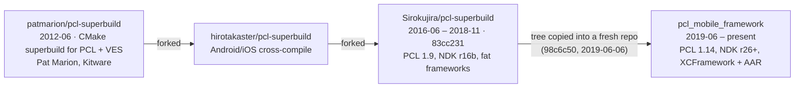

# Lineage

`pcl_mobile_framework` is the successor to
[**Sirokujira/pcl-superbuild**](https://github.com/Sirokujira/pcl-superbuild).
It is not a rewrite from scratch: the repository started life in June 2019 as a
verbatim copy of that project's tree, and everything since has been an
incremental modernization of the same build system, the same wrappers and the
same packaging idea.

Because the copy was made with plain `cp` rather than `git clone`, GitHub does
not show the two repositories as fork and parent. This document — plus the
history graft described in [Reconstructed git history](#reconstructed-git-history)
— is the record of that relationship.

## Timeline



| Stage | Repository | Range | Boundary commit |
|---|---|---|---|
| Origin | `patmarion/pcl-superbuild` | 2012-06-27 → | `7bbe666` — first commit, Pat Marion (Kitware) |
| Fork | `hirotakaster/pcl-superbuild` | → 2016 | GitHub fork parent of the next row |
| Predecessor | `Sirokujira/pcl-superbuild` | 2016-06-14 → 2018-11-23 | `83cc231` — last development commit |
| Current | `Sirokujira/pcl_mobile_framework` | 2019-06-06 → | `98c6c50` — initial import |

The first three rows share one continuous git history; GitHub still records
`Sirokujira/pcl-superbuild` as a fork of `hirotakaster/pcl-superbuild`. Only
the last hop lost its ancestry, and that is what the graft below restores.

`83cc231` is tagged in this repository as **`pcl-superbuild-origin`**.

## Reconstructed git history

The predecessor's commits are present in this repository as a `refs/replace`
graft that attaches `98c6c50` ("add build pcl binaries generate files", the
initial import) to `83cc231` (pcl-superbuild's last development commit; that
repository has since received only a pointer to this one). Nothing is
rewritten — every existing SHA stays valid — but `git log` walks straight
through the seam back to 2012.

```bash
git fetch origin 'refs/replace/*:refs/replace/*'
git log --oneline | tail -5   # ends at 7bbe666 (2012-06-27)
```

```bash
git log --oneline pcl-superbuild-origin   # the predecessor's history alone
```

To ignore the graft for a single command, use `git --no-replace-objects log`.
GitHub's web UI and API do not apply replace refs, so the seam is only visible
in a clone that has fetched them.

Maintainers re-creating the graft from scratch:

```bash
git remote add legacy https://github.com/Sirokujira/pcl-superbuild
git config remote.legacy.tagOpt --no-tags
git fetch legacy 'refs/heads/*:refs/remotes/legacy/*'
git replace --graft 98c6c50 83cc231
```

## What came from where

Every path below traces back to `pcl-superbuild@83cc231` (or to the 2019
import commit `98c6c50`, which carried a few files — the AppVeyor installers,
the Android wrapper — that had already been deleted from pcl-superbuild's
`master` by then).

### Build system

| pcl-superbuild | Today | Change |
|---|---|---|
| `CMakeLists.txt` | [`CMakeLists.txt`](../CMakeLists.txt) | Same superbuild driver; per-dependency includes instead of one macro file. |
| `setup-superbuild.cmake` | [`cmake/SetupSuperbuild.cmake`](../cmake/SetupSuperbuild.cmake) | Renamed, slimmed. |
| `setup-project-variables.cmake` | [`cmake/ProjectVariables.cmake`](../cmake/ProjectVariables.cmake) | Renamed; legacy arch options dropped. |
| `external-project-macros.cmake` | [`cmake/external/*.cmake`](../cmake/external/) | Split one 20 KB macro file into one file per dependency. The public names survived: `install_eigen`, `crosscompile_boost`, `crosscompile_flann`, `crosscompile_qhull`, `crosscompile_pcl`. |
| — | `cmake/external/lz4.cmake` | New; FLANN 1.9.2 needs an external LZ4. |
| `toolchains/` (15 files: `iOS_Device_*`, `iOS_Simulator_*`, `Toolchain-iPhone*`, `iOS*.cmake`, `common-ios-toolchain.cmake`) | [`cmake/toolchains/ios.toolchain.cmake`](../cmake/toolchains/ios.toolchain.cmake) | Collapsed into one `PLATFORM`-driven toolchain. |
| `toolchains/pcl-try-run-results.cmake` | [`cmake/toolchains/pcl-try-run-results.cmake`](../cmake/toolchains/pcl-try-run-results.cmake) | Byte-identical to this day — deliberately left without a provenance header so that `diff` against the predecessor keeps returning nothing. |
| `toolchains/vtk-try-run-results.cmake` | — | VTK was never enabled. |

### Scripts

| pcl-superbuild | Today | Change |
|---|---|---|
| `makeFramework.sh`, `makeFramework2.sh` | [`scripts/make_xcframework.sh`](../scripts/make_xcframework.sh) | 763 lines of near-duplicate `lipo` logic → `xcodebuild -create-xcframework`. |
| `build_ios_device_framework.sh`, `build_ios_simulator_framework.sh`, `build_ios_universal_binary.sh`, `build_ios_universal_framework.sh` | [`scripts/build_ios.sh`](../scripts/build_ios.sh) | One script, slice list via `IOS_SLICES`. |
| `build_android.sh`, `build_android.bat` | [`scripts/build_android.sh`](../scripts/build_android.sh) | Broken shell continuation fixed; ABI list parameterized. |
| `AndroidWrapper/InstallPointCloudLibrary.{sh,bat}` | [`scripts/build_android.sh`](../scripts/build_android.sh) | Prebuilt-artifact download replaced by building from source. |
| `strip-frameworks.sh` | [`strip-frameworks.sh`](../strip-frameworks.sh) | Unchanged (Realm Inc., Apache-2.0). |
| `xamarinObjevtiveSharpie.sh` | — | Xamarin reached EOL in 2024. |

### Wrappers

| pcl-superbuild | Today | Change |
|---|---|---|
| `iOSWrapper/PointCloudLibraryInterface.{h,mm}`, `PointCloudLibraryWrapper.{hpp,cpp}`, `PointCloudLibraryConversions.{h,cxx}`, `PointCloudLibraryVoxelGrid.*`, `PointCloudLibrarySACSegmentationPlane.*` | [`iOSWrapper/Sources/`](../iOSWrapper/Sources/) (`PCLMPointCloud.mm`, `PCLMFilters.mm`, `PCLMSegmentation.mm`, `PCLMSurface.mm`, …) | Loose C/C++ entry points → an Objective-C++ facade with a public umbrella header. |
| `iOSWrapper/{module,iphoneos,iphonesimulator}.modulemap` | [`iOSWrapper/module.modulemap`](../iOSWrapper/module.modulemap) | One module map; the XCFramework handles per-platform selection. |
| `iOSWrapper/framework.plist{,.in}` | [`iOSWrapper/Sources/Info.plist`](../iOSWrapper/Sources/Info.plist) | — |
| `iOSWrapper/{Bridge,Wrapper}.swift.txt`, `ProjectName-Bridging-Header.h.txt` | Swift Package (`Package.swift`) | Copy-paste snippets → a real SwiftPM `binaryTarget`. |
| `AndroidWrapper/` (from `98c6c50`) | [`AndroidWrapper/aar/`](../AndroidWrapper/aar/) | Two competing `CMakeLists.txt` consolidated into the AAR module; Groovy → Kotlin DSL; AGP 3.4 → 8.5. |

### CI and distribution

| pcl-superbuild | Today | Change |
|---|---|---|
| `appveyor.yml` + `appveyor/` | [`.github/workflows/`](../.github/workflows/) | VS2015 + MinGW + NDK r16b images no longer exist. |
| `.travis.yml` | [`.github/workflows/`](../.github/workflows/) | Travis OSS ended. |
| `.circleci/config.yml` | [`.github/workflows/`](../.github/workflows/) | `circleci/android:api-26-alpha` image. |
| `.azure-pipelines.yml` | [`.github/workflows/`](../.github/workflows/) | — |
| Fat `.framework` via `lipo` | `PCLMobile.xcframework` | Apple deprecated fat device+simulator binaries. |
| README mentions of Pod/Carthage/SPM | `Package.swift`, `PCLMobile.podspec`, Maven/GitHub Packages | Distribution actually implemented. |

The imported originals are kept verbatim under
[`.deprecated/`](../.deprecated/README.md), which records the same mapping from
the replacement side. Each surviving descendant also carries a one-line
`Derived from Sirokujira/pcl-superbuild@83cc231 …` note in its file header, so
the relationship is visible without leaving the file:

```bash
grep -rl "pcl-superbuild@83cc231" --exclude-dir=.git .
```

## Versions carried across

| | pcl-superbuild (2018) | pcl_mobile_framework (now) |
|---|---|---|
| PCL | 1.9 | 1.14.x |
| Boost | 1.60.0 + custom patches | 1.84.0 (unpatched) |
| Eigen | 3.3.4 | 3.4.0 |
| FLANN | 1.9.1 | 1.9.2 (+ external LZ4) |
| Qhull | 2015.2 | 2020.2 |
| CMake | 3.4 – 3.12 | 3.24+ |
| Android NDK | r16b (GCC 4.9 / Clang 3.6) | r26+ |
| Xcode / iOS | Xcode 9.3, iOS 6.0/8.0 targets | Xcode 15+, iOS 13+ |

See [MODERNIZATION_PLAN.md](../MODERNIZATION_PLAN.md) for the full plan that
drove this transition.

## Licensing

`pcl-superbuild` shipped without a `LICENSE` file, and neither did the
`hirotakaster` fork or `patmarion/pcl-superbuild` upstream of it — the latter
being a CMake superbuild for PCL and VES. The Point Cloud Library those
scripts exist to build is distributed under the
[3-clause BSD license](https://github.com/PointCloudLibrary/pcl/blob/master/LICENSE.txt);
this repository's [`LICENSE`](../LICENSE) (Apache-2.0) was chosen with that
lineage in mind and is compatible with it — BSD-3-Clause terms permit
redistribution under Apache-2.0 provided the original copyright notice is
retained.

Third-party code that keeps its own terms:

* [`strip-frameworks.sh`](../strip-frameworks.sh) — Realm Inc., Apache-2.0
  (carried over unmodified from pcl-superbuild).
* [`cmake/toolchains/ios.toolchain.cmake`](../cmake/toolchains/ios.toolchain.cmake)
  — patterned after `leetal/ios-cmake` (BSD-3-Clause).
* The dependencies fetched at build time (PCL, Boost, Eigen, FLANN, Qhull,
  LZ4) retain their upstream licenses; none of their source is vendored here.
